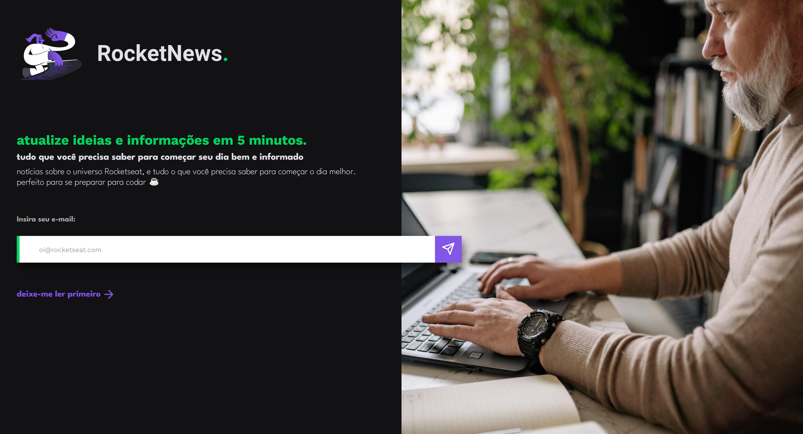

<h1 align="center"> RocketNews </h1>

  <a href="#-tecnologias">Tecnologias</a>&nbsp;&nbsp;&nbsp;|&nbsp;&nbsp;&nbsp;
  <a href="#-projeto">Projeto</a>

## 🚀 Tecnologias

Esse projeto foi desenvolvido com as seguintes tecnologias:

- HTML
- CSS
- JavaScript
- Git and GitHub

## 💻 Projeto

Este projeto simula uma página para captação de leads ou newsletters.  

Obs: Projeto construído a partir da área de desafios do Programa Discover da [Rocketseat](https://rocketseat.com.br). Após construir o projeto proposto, adicionei mais funcionalidades, como por exemplo: layout totalmente responsivo e função alert() ao clicar no botão de enviar o email.